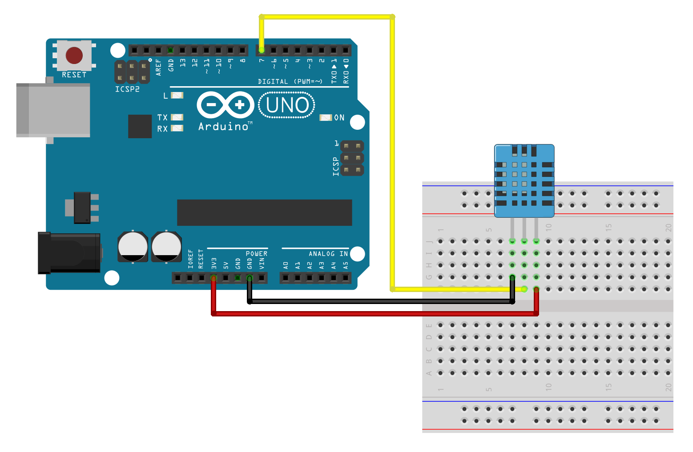

# PyDHT
### A python script that receives DHT sensor data from the Arduino board through the Serial port and saves it into the InfluxDB

## How To Set Up


### Arduino
The Arduino board should be connected to the PC through the USB

#### Requirements
* [Time Library v1.6.1](https://github.com/PaulStoffregen/Time)
* [DHT Library v1.4.4](https://github.com/adafruit/DHT-sensor-library)

#### Circuit



### Python
1. Create a virtual environment
2. Activate the virtual environment
3. Install requirements using `pip install -r requirements.txt`
4. Rename `.env.example` to `.env` and fill in the data
5. start script using ```python main.py [-v] <PORT> <BAUD>```. Also, the help command is available ```python main.py --help```

## InfluxDB Dashboard


You can build and customize your dashboard to monitor DHT data

Also, You can download and import this dashboard from this [gist](https://gist.github.com/iAliF/dbfa4e91931be315a42405d3fe809b6a)
